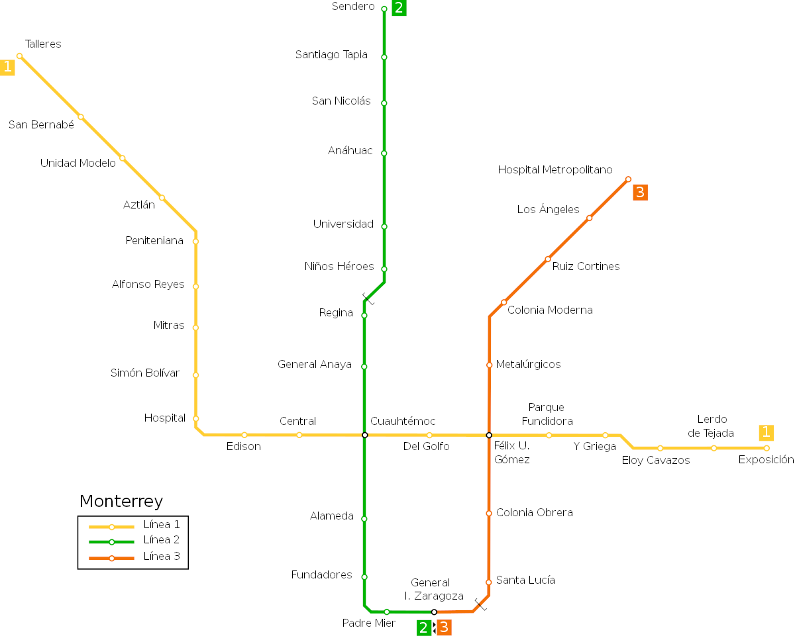

# Shortest Path

For this problem, create a new file called `metrorrey.py`.

Build a graph of the _Metrorrey_ (Monterrey’s metro transit system) using the graph framework from [chapter 4](https://learning.oreilly.com/library/view/classic-computer-science/9781617295980/kindle_split_013.html) of [KOPEC].

Source: [Wikimedia](https://upload.wikimedia.org/wikipedia/commons/thumb/1/1d/Mapa_del_Metrorrey.svg/1200px-Mapa_del_Metrorrey.svg.png)

Afterwards, use the `bfs` function from the from the `generic_search` module to find the shortest paths:

1. From _Sendero_ to _Exposición_
1. From _Talleres_ to _Hospital Metropolitano_
1. From _Alameda_ to _Colonia Obrera_
1. From _Universidad_ to _Santa Lucía_
1. From _General I Zaragoza_ to _Del Golfo_
1. From _Lerdo de Tejada_ to _Padre Mier_
